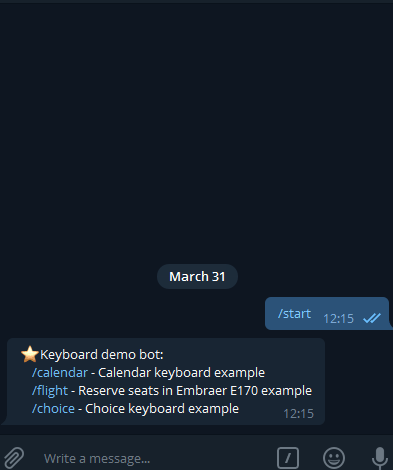
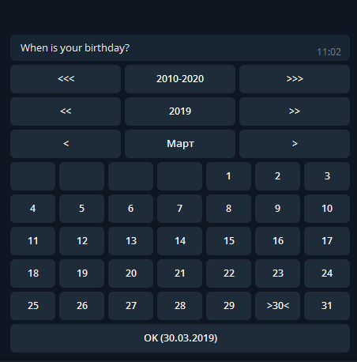

# Funogram.Keyboard

Extension for [Funogram](https://github.com/Dolfik1/Funogram/) for working with telegram inline keyboards.

Build your own keyboard using [Funogram.Keyboard](https://www.nuget.org/packages/Funogram.Keyboard)

Or use existing keyboard, for example [Funogram.Keyboard.Calendar](https://www.nuget.org/packages/Funogram.Keyboard.Calendar)

 

