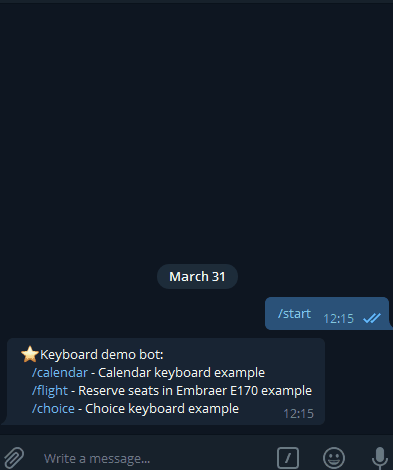

# Funogram.Keyboard

Extension for [Funogram](https://github.com/Dolfik1/Funogram/) for working with telegram inline keyboards.

Nuget Funogram.Keyboard package is [here](https://www.nuget.org/packages/Funogram.Keyboard)

 

